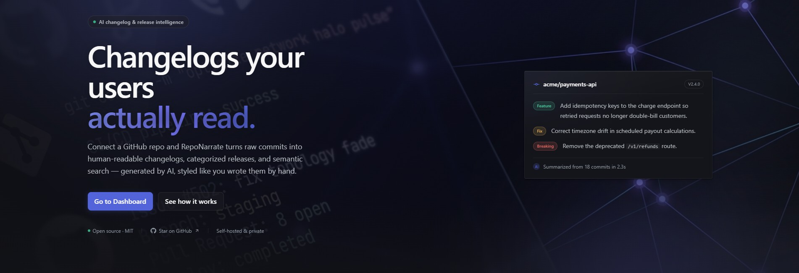
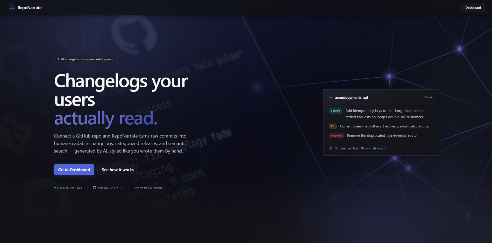
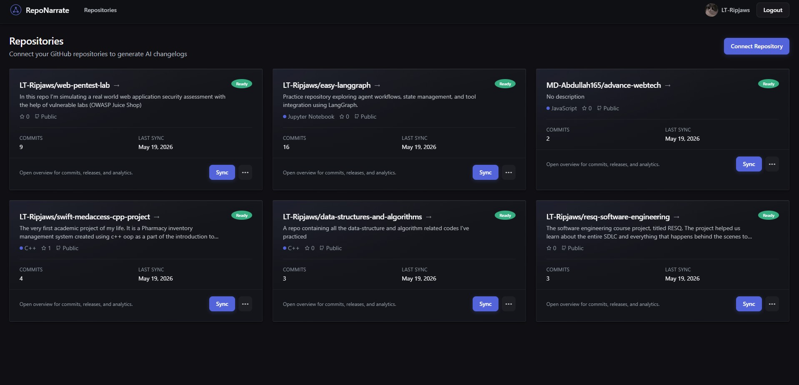
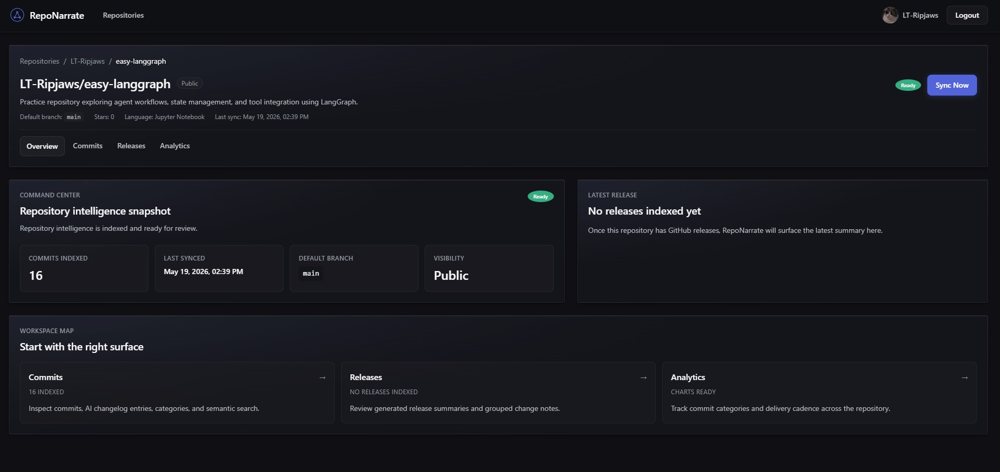
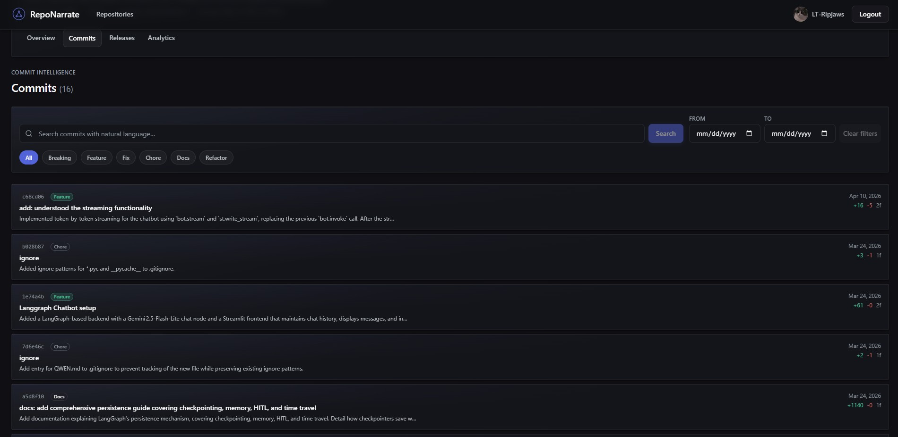
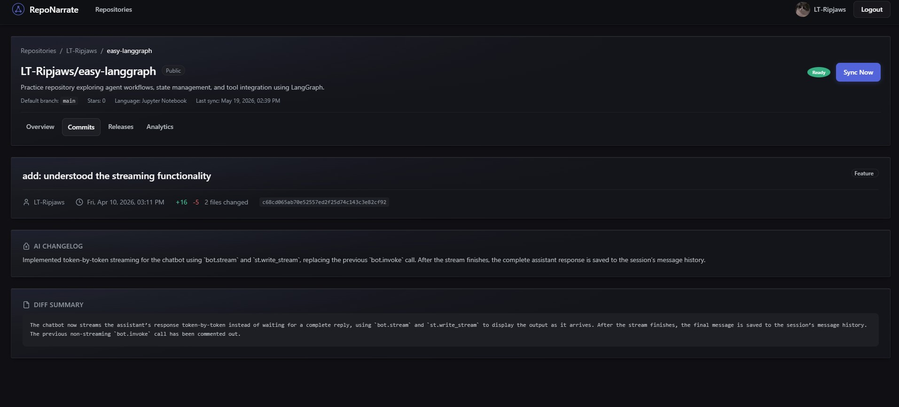
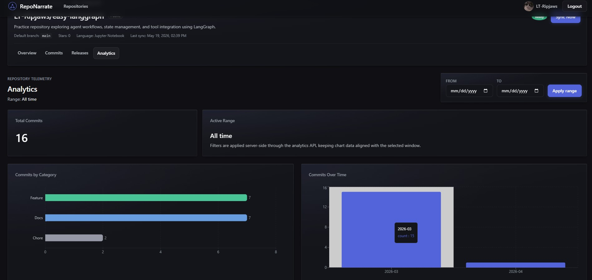

# RepoNarrate

RepoNarrate is a full-stack AI changelog intelligence app. It connects to a GitHub repository, syncs commits and releases, uses AI to turn raw commit history into readable changelog notes, and presents the results through commits, releases, semantic search, and analytics dashboards.

In simple terms: connect a repo, let the backend sync it, then review clean AI-generated explanations of what changed.

## Preview

<p align="center">
  
</p>

## Screenshots

<table>
  <tr>
    <td align="center"><strong>Landing Page</strong></td>
    <td align="center"><strong>Repository Dashboard</strong></td>
  </tr>
  <tr>
    <td></td>
    <td></td>
  </tr>
  <tr>
    <td align="center"><strong>Repository Workspace</strong></td>
    <td align="center"><strong>Commit Intelligence</strong></td>
  </tr>
  <tr>
    <td></td>
    <td></td>
  </tr>
  <tr>
    <td align="center"><strong>AI Commit Summary</strong></td>
    <td align="center"><strong>Analytics</strong></td>
  </tr>
  <tr>
    <td></td>
    <td></td>
  </tr>
</table>

## Features

- GitHub OAuth login
- Connect public or private GitHub repositories available to the signed-in user
- Background repository sync with live progress
- AI-generated commit changelog entries
- AI-generated diff summaries
- AI commit categories: `breaking`, `feature`, `fix`, `chore`, `docs`, `refactor`
- AI-generated release summaries grouped by change type
- Natural-language semantic search over commits
- Repository analytics with category and monthly commit charts
- Protected dashboard using httpOnly cookie authentication
- Live sync progress over Server-Sent Events, with polling as an automatic fallback
- Incremental GitHub sync (conditional ETag + `since` + pagination) for cheap re-syncs
- Optional single-call AI analysis that cuts ~3 LLM calls/commit down to 1
- Horizontally scalable: split web/worker processes with distributed rate limiting
- Prometheus-style `/metrics` endpoint and TypeORM migrations
- Swagger API docs in development/local mode

All scaling and cost features are behind environment flags that default to the
original single-process behavior — see [Scaling & Feature Flags](#scaling--feature-flags).

## Tech Stack

| Layer | Technology | Purpose |
|---|---|---|
| Frontend | Next.js 14, React 18, TypeScript | App Router pages, SSR, client components, typed UI |
| Styling | Tailwind CSS, custom CSS variables, Geist fonts | Dark dashboard design system |
| Charts | Recharts | Commit analytics visualizations |
| API client | Axios and server-side fetch helpers | Browser and SSR API calls |
| Backend | NestJS 11, TypeScript | Modular REST API |
| Database | PostgreSQL with pgvector | Relational data plus vector search |
| ORM | TypeORM | Entity mapping and repository access |
| Queue | Bull with Redis | Background repository sync jobs |
| Realtime | Redis pub/sub + SSE | Live sync progress push (poll fallback) |
| Rate limiting | Redis token bucket | Distributed per-provider AI throttling |
| Observability | Prometheus-style `/metrics` | Queue depth, AI/GitHub call counters |
| Migrations | TypeORM CLI + runtime | Additive schema deltas over a frozen baseline |
| Auth | GitHub OAuth, Passport, JWT | Login and protected API routes |
| AI text | OpenAI SDK against Kilo Code gateway | Diff summaries, categories, changelog entries, release summaries |
| AI embeddings | Google Gemini embeddings | Semantic commit search |
| Security | Helmet, CORS, rate limiting, CSRF origin checks | Safer cookie-based web app |

## Repository Structure

```text
github-ai-changelog/
  backend/                  NestJS API
    src/
      ai/                   AI prompts and provider calls (incl. single-call analyzeCommit)
      analytics/            Commit analytics API
      auth/                 GitHub OAuth and JWT auth
      bootstrap/            Frozen ensureSchema() baseline (shared by web + worker)
      commits/              Commit list, detail, filters, semantic search
      common/               Guards, filters, DTOs, middleware, utilities
        metrics/            Prometheus-style /metrics endpoint
        ratelimit/          Distributed Redis rate limiter
        pubsub/             Redis pub/sub for SSE status push
      jobs/                 Bull queue and sync processor (ROLE/concurrency aware)
      migrations/           TypeORM migration deltas
      releases/             Release list and detail API
      repos/                Repo connection, GitHub API client, ingestion pipeline
      users/                User storage and encrypted GitHub token access
      main.ts               Web entrypoint (HTTP API)
      worker.ts             Worker entrypoint (sync processor, no HTTP)
      data-source.ts        Standalone DataSource for the TypeORM CLI
  frontend/                 Next.js app
    src/
      app/                  App Router pages and layouts
      components/           UI, dashboard, repo, commit, release, chart components
      lib/                  API helpers, types, formatting, config
  docker-compose.yml        Local PostgreSQL + Redis services
  dev.ps1                   Windows development startup helper
  dev.sh                    Unix-style development startup helper
```

## How The App Works

```text
User
  -> signs in with GitHub
  -> connects a repository
  -> backend verifies the repo with GitHub
  -> backend queues a sync job
  -> worker fetches commits, diffs, and releases
  -> AI summarizes and categorizes changes
  -> PostgreSQL stores repo, commit, release, and embedding data
  -> frontend shows commits, release notes, search, and analytics
```

Important flow:

1. The user signs in through `GET /auth/github`.
2. GitHub redirects back to `GET /auth/github/callback`.
3. The backend stores/updates the user and encrypts the GitHub access token.
4. The backend creates a JWT and sets it as an httpOnly `token` cookie.
5. The dashboard reads protected data using that cookie.
6. When a repo is connected, the backend creates a repo record and queues a Bull job.
7. The job syncs commits/releases and stores AI-enriched results (in the web process by default, or a separate worker process when split).
8. The frontend shows live progress via SSE when enabled, otherwise polls repo status while sync is running.

## Backend Overview

The backend is a NestJS app. It is organized by feature modules:

| Module | Responsibility |
|---|---|
| `AuthModule` | GitHub OAuth, JWT cookie auth, logout, current user |
| `UsersModule` | User lookup, upsert, encrypted GitHub access token storage |
| `ReposModule` | Connect/list/delete repos, queue sync, get status, GitHub API client |
| `JobsModule` | Bull queue setup and repo sync processor |
| `AiModule` | Diff summaries, categories, changelog entries, release summaries, embeddings |
| `CommitsModule` | Commit list/detail/filtering and semantic search |
| `ReleasesModule` | Release list and release detail lookup |
| `AnalyticsModule` | SQL aggregation for dashboard charts |
| `MetricsModule` | Prometheus-style `/metrics` (queue depth, AI/GitHub counters) |
| `RatelimitModule` | Distributed Redis rate limiter for AI providers |
| `RedisPubSubModule` | Pub/sub channel powering the SSE status stream |

The web entry point is `backend/src/main.ts`. It sets up:

- schema bootstrap (`ensureSchema()`) then TypeORM migration deltas
- cookie parsing
- GitHub OAuth session state support
- CORS for the frontend URL
- Swagger in development/local mode
- rate limiting (skips `/health`, `/metrics`, status/stream endpoints)
- CSRF origin/referer checks for mutating requests
- global DTO validation
- global exception filtering

`backend/src/worker.ts` is the worker entry point. It boots the same modules
without an HTTP server so Bull processors run in a separate process. The
`ROLE` env var (`all` default | `web` | `worker`) selects the mode; `all`
keeps the original single-process behavior.

## Database Tables

The app uses PostgreSQL. The frozen idempotent baseline is `ensureSchema()` in
`backend/src/bootstrap/ensure-schema.ts`; all later schema changes are additive
TypeORM migrations in `backend/src/migrations/` that run automatically on web
boot (after the baseline). For example, `repos.commits_etag` is added by a
migration, not the baseline.

| Table | Purpose |
|---|---|
| `users` | GitHub user profile and encrypted GitHub access token |
| `repos` | Connected repositories and sync status |
| `commits` | Raw commit metadata plus AI summary/category/changelog |
| `commit_embeddings` | pgvector embeddings for semantic search |
| `releases` | GitHub releases plus AI summaries and grouped change arrays |
| `release_commits` | Many-to-many link between releases and commits |

Commit SHA uniqueness is scoped by repository using `repo_id + sha`, because the same commit SHA can exist across different repositories.

## API Overview

Most routes are protected with JWT cookie auth. The main endpoints are:

| Method | Endpoint | Purpose |
|---|---|---|
| `GET` | `/health` | Backend health check |
| `GET` | `/metrics` | Prometheus-style metrics (unauthenticated) |
| `GET` | `/auth/github` | Start GitHub OAuth |
| `GET` | `/auth/github/callback` | Finish OAuth, set cookie, redirect |
| `GET` | `/auth/me` | Get current user |
| `POST` | `/auth/logout` | Clear auth cookie |
| `POST` | `/repos` | Connect a repository |
| `GET` | `/repos` | List connected repositories |
| `GET` | `/repos/:id` | Get one repository |
| `DELETE` | `/repos/:id` | Remove a repository |
| `POST` | `/repos/:id/sync` | Queue a repository sync |
| `GET` | `/repos/:id/status` | Get sync status and progress |
| `GET` | `/repos/:id/status/stream` | SSE stream of live sync status |
| `GET` | `/repos/:repoId/commits` | List commits with filters |
| `GET` | `/repos/:repoId/commits/:sha` | Get one commit |
| `POST` | `/repos/:repoId/commits/search` | Semantic commit search |
| `GET` | `/repos/:repoId/releases` | List releases |
| `GET` | `/repos/:repoId/releases/tag/:tagName` | Get release by tag |
| `GET` | `/repos/:repoId/analytics` | Get commit analytics |

In development/local mode, Swagger is available at:

```text
http://localhost:3001/api
```

## Prerequisites

- Node.js LTS
- npm
- Docker Desktop or Docker Engine
- GitHub OAuth App
- Gemini API key
- Kilo Code API key

> **Clone into a path without spaces** (e.g. `C:\dev\github-ai-changelog`, not
> `C:\My Projects\...`). The dev scripts use `nest start --no-shell`, which
> fails when the project path contains spaces — see
> [Troubleshooting](#backend-dev-server-fails-when-the-project-path-has-spaces).

## GitHub OAuth Setup

Create a GitHub OAuth App with:

```text
Homepage URL: http://localhost:3000
Authorization callback URL: http://localhost:3001/auth/github/callback
```

The backend currently requests these scopes:

```text
user:email
repo
```

The `repo` scope is broad, but classic GitHub OAuth does not provide a private-repository read-only scope. A GitHub App or fine-grained token flow would be a better production option.

## Environment Variables

Create these files from the examples:

```bash
cp backend/.env.example backend/.env
cp frontend/.env.example frontend/.env.local
```

On Windows PowerShell:

```powershell
Copy-Item backend/.env.example backend/.env
Copy-Item frontend/.env.example frontend/.env.local
```

### Backend `.env`

Required backend variables:

```env
PORT=3001
NODE_ENV=development

DB_HOST=localhost
DB_PORT=5432
DB_USERNAME=postgres
DB_PASSWORD=postgres
DB_NAME=changelog_db

REDIS_HOST=localhost
REDIS_PORT=6379

JWT_SECRET=your_64_char_hex_jwt_secret_here
JWT_EXPIRES_IN=7d
SESSION_SECRET=your_64_char_hex_session_secret_here
ENCRYPTION_KEY=your_64_char_hex_encryption_key_here

GITHUB_CLIENT_ID=your_github_oauth_client_id
GITHUB_CLIENT_SECRET=your_github_oauth_secret
GITHUB_CALLBACK_URL=http://localhost:3001/auth/github/callback

GEMINI_API_KEY=your_gemini_api_key
KILOCODE_API_KEY=your_kilo_code_key
KILOCODE_MODEL=nvidia/nemotron-3-super-120b-a12b:free

FRONTEND_URL=http://localhost:3000
```

Generate secrets with:

```bash
openssl rand -hex 32
```

`ENCRYPTION_KEY` must be exactly 64 hex characters because it is used as a 32-byte AES-256-GCM key.

### Frontend `.env.local`

```env
NEXT_PUBLIC_API_URL=http://localhost:3001
BACKEND_URL=http://localhost:3001
NEXT_PUBLIC_STATUS_TRANSPORT=poll
```

`NEXT_PUBLIC_API_URL` is used by browser-side Axios calls. `BACKEND_URL` is used by server-side Next.js fetch helpers. `NEXT_PUBLIC_STATUS_TRANSPORT` (`poll` default | `sse`) selects how the dashboard tracks sync progress; set to `sse` only together with the backend's `STATUS_TRANSPORT=sse`, and rebuild the frontend after changing it.

## Scaling & Feature Flags

Every flag below is optional and **defaults to the original single-process
behavior**, so the app runs unchanged with none of them set. They are
documented in `backend/.env.example`.

| Variable | Default | Effect when changed |
|---|---|---|
| `ROLE` | `all` | `web` (API only) or `worker` (sync only, no HTTP). Set **per process at launch**, not in shared `.env`. |
| `SYNC_CONCURRENCY` | `1` | Concurrent repo syncs per worker. Only safe with `RATE_LIMITER=redis`. |
| `RATE_LIMITER` | `memory` | `redis` enables distributed per-provider AI throttling (required for >1 process or concurrency >1). |
| `KILO_MIN_INTERVAL_MS` / `GEMINI_MIN_INTERVAL_MS` | `400` / `800` | Min ms between AI calls per provider. |
| `SYNC_RATE_MAX` / `SYNC_RATE_DURATION_MS` | unset / `1000` | Optional coarse Bull job-rate cap. |
| `AI_COMBINED_ANALYSIS` | `off` | `on` collapses 3 LLM calls/commit into 1 structured call (per-field fallback on parse failure, so never worse). |
| `INCREMENTAL_SYNC` | `off` | `on` enables conditional ETag + `since` + Link pagination; lifts the 100-commit cap up to `MAX_COMMITS_PER_SYNC`. |
| `MAX_COMMITS_PER_SYNC` | `500` | Upper bound when `INCREMENTAL_SYNC=on`. |
| `STATUS_TRANSPORT` | `poll` | `sse` pushes progress over Redis pub/sub + SSE. Pair with frontend `NEXT_PUBLIC_STATUS_TRANSPORT=sse`. |

Rules of thumb:

- The horizontal-scale payoff only lands when you actually run split `web` +
  `worker` processes with `RATE_LIMITER=redis`.
- Never raise `SYNC_CONCURRENCY` or run multiple workers on the in-memory limiter.
- SSE needs both sides set; the frontend must be rebuilt after changing
  `NEXT_PUBLIC_*`. If the stream errors, the dashboard auto-falls back to polling.

### Running split web + worker

```bash
cd backend
npm run build

# terminal 1 — API only
ROLE=web node dist/main

# terminal 2 — sync worker only
ROLE=worker SYNC_CONCURRENCY=4 node dist/worker
```

On Windows PowerShell, set the variable first: `$env:ROLE='worker'; node dist/worker`.

## Installation

Install backend dependencies:

```bash
cd backend
npm install
```

Install frontend dependencies:

```bash
cd frontend
npm install
```

## Running Locally

From the repository root, start PostgreSQL and Redis:

```bash
docker compose up -d
```

Start the backend:

```bash
cd backend
npm run start:dev
```

Start the frontend in another terminal:

```bash
cd frontend
npm run dev
```

Open:

```text
Frontend: http://localhost:3000
Backend:  http://localhost:3001
Swagger:  http://localhost:3001/api
```

## Development Helper Scripts

This repo also includes startup helpers.

Windows PowerShell:

```powershell
.\dev.ps1
```

Unix-style shell:

```bash
./dev.sh
```

The helpers start Docker services, backend, frontend, and write logs to `.dev-logs/`.

Useful PowerShell preflight:

```powershell
.\dev.ps1 -CheckOnly
```

Start and stop after both services become ready:

```powershell
.\dev.ps1 -ExitAfterReady
```

## Common Development Commands

Backend:

```bash
cd backend
npm run start:dev
npm run start:worker          # sync worker, no HTTP (ROLE=worker)
npm run build
npm run test
npm run test:e2e
npm run lint
npm run migration:generate -- src/migrations/Name
npm run migration:run
npm run migration:revert
```

Frontend:

```bash
cd frontend
npm run dev
npm run build
npm run lint
```

## Security Notes

- Auth uses GitHub OAuth.
- The backend stores the app session as a JWT in an httpOnly cookie.
- The GitHub access token is encrypted before being saved in the database.
- Cookie-based auth is protected with SameSite cookies and Origin/Referer checks for mutating requests.
- CORS allows only the configured frontend origin.
- Helmet adds common security headers on the backend.
- The frontend adds basic security response headers through Next.js config.
- Swagger is disabled outside development/local mode.
- The global exception filter avoids returning raw server stack traces for unexpected errors.

## Sync Behavior

Repository sync is intentionally asynchronous:

1. The API validates and stores the repository.
2. A Bull job is queued in Redis.
3. The worker fetches GitHub commits and releases.
4. AI providers summarize, categorize, and embed commit data.
5. PostgreSQL stores the results.
6. The repo status becomes `ready` or `error`.

If the browser is closed during sync, the backend job continues as long as the backend, Redis, and PostgreSQL are still running. If the whole dev stack is stopped, the sync may be interrupted. Running sync again continues by skipping complete commits and reprocessing incomplete AI fields.

With `INCREMENTAL_SYNC=on`, re-syncing an unchanged repo does almost no work: the GitHub `since` filter (and conditional ETag) return nothing new, so no commits are reprocessed and no AI calls are made. With `AI_COMBINED_ANALYSIS=on`, each newly processed commit makes one combined AI call instead of three. With `STATUS_TRANSPORT=sse`, the worker publishes progress that the dashboard receives as a live push.

## Troubleshooting

### Backend dev server fails when the project path has spaces

Symptom: `npm run start:dev` / `npm run start:debug` (and `dev.ps1` / `dev.sh`,
which call them) fail to launch the backend with a quoting / "cannot find
module" style error when the repository lives in a path that contains spaces
(e.g. `C:\Users\me\My Projects\...`).

Cause: those scripts pass `--no-shell` to `nest start`. The NestJS CLI quotes
the compiled entry path for the shell, but in `--no-shell` mode there is no
shell to strip the quotes, so the quote characters become part of the path and
Node cannot resolve it. This is a NestJS CLI limitation, not an app bug.

Fixes, in order of preference:

- Clone the repository into a path **without spaces** (simplest, recommended).
- Or use the tsc-based watcher, which does not pass `--no-shell`:
  `cd backend && npm run start:dev:tsc` (slower rebuilds than swc).
- Or build and run without the watcher: `npm run build && npm run start:prod`
  (no hot reload). The split commands `node dist/main` / `node dist/worker`
  are also unaffected.

Only the two `--no-shell` dev scripts are impacted; production start and the
web/worker split commands work regardless of path.

### Backend fails on startup

Check that:

- `backend/.env` exists
- `JWT_SECRET` is at least 32 characters
- `ENCRYPTION_KEY` is 64 hex characters
- PostgreSQL and Redis are running
- `DB_*` and `REDIS_*` values match your local ports

### GitHub login fails

Check that:

- GitHub OAuth callback URL is exactly `http://localhost:3001/auth/github/callback`
- `GITHUB_CLIENT_ID` and `GITHUB_CLIENT_SECRET` are correct
- `FRONTEND_URL=http://localhost:3000`

### Repo sync stays pending or syncing

Check backend logs in `.dev-logs/backend.log` or the backend terminal. Common causes are:

- GitHub token expired or revoked
- GitHub API rate limit
- missing AI provider key
- Redis not running
- backend stopped during the job

### Dashboard progress looks stale

The frontend tracks `/repos/:id/status` while a repo is `pending` or `syncing` — by polling, or over SSE when `STATUS_TRANSPORT=sse` is set on both sides. If SSE errors, it automatically falls back to polling. If the backend has finished but the dashboard looks old, refresh the dashboard or open the repo page to force a fresh server fetch. The dashboard also auto-resumes tracking for in-flight repos.

## Known Limitations

- By default sync fetches the latest 100 commits per repository; `INCREMENTAL_SYNC=on` lifts this up to `MAX_COMMITS_PER_SYNC`.
- Semantic search uses brute-force pgvector distance because the Gemini embedding dimension is 3072 (an HNSW index / ≤2000-dim re-embedding is deferred — see `plan.md` Phase 5).
- TypeORM migrations exist for additive deltas; the frozen `ensureSchema()` baseline remains the bootstrap and is intentionally not migrated.
- AI output can vary and should be reviewed before using it as official release communication. `AI_COMBINED_ANALYSIS` effectiveness depends on the configured model returning parseable JSON (it safely falls back to per-field calls otherwise).
- Classic GitHub OAuth requires the broad `repo` scope for private repository access.

## License

This repository includes a `LICENSE` file. Review it before reusing or distributing the project.
